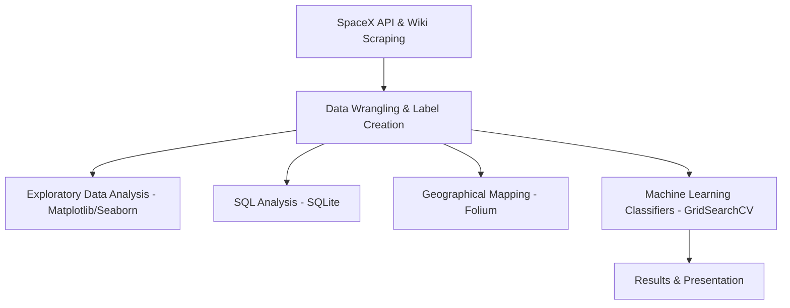

# SpaceX Falcon 9 First Stage Landing Prediction
[](https://www.coursera.org/professional-certificates/ibm-data-science)
[](https://www.python.org/)
[](https://scikit-learn.org/)
[](https://python-visualization.github.io/folium/)

## Project Overview
This project predicts the landing success of the SpaceX Falcon 9 first stage rocket. By predicting launch success, we can determine the commercial viability of a launch and estimate launch bid prices.

## Business Problem
Determine whether the Falcon 9 first stage will land successfully on ground pads or drone ships. Successful landing prediction allows competitors to bid against SpaceX and helps insurers/investors calculate risk.

## Objectives
1. **Collect SpaceX Launch Data** via API and Web Scraping.
2. **Clean and Prepare Data** for analysis and model training.
3. **Analyze Data** using SQL and Exploratory Data Analysis (EDA).
4. **Build Interactive Maps** using Folium to identify geographical launch site patterns.
5. **Develop Machine Learning Classifiers** (LR, SVM, Decision Tree, KNN) to predict landing outcomes.

---

## Technical Workflow


## Dataset Heuristics
- **Total Flights:** 90 Falcon 9 launches (2010 - 2020)
- **Base Landing Success Rate:** 66.67%
- **Target Feature:** `Class` (1 = successful recovery, 0 = landing failure/expendable)

## Methodology & Results
- **EDA Insights:** Launch successes increased significantly post-2015. High-mass payloads are launched from Florida pads. Orbits ES-L1, HEO, GEO, and SSO show 100% success.
- **SQL Audits:** Checked total NASA payload (45,596 kg) and max payload Starlink flights (15,600 kg).
- **Folium GIS:** Verified pads are situated near the coast (<1 km) for safety.
- **ML Performance Table:**
  - **Support Vector Machine (SVM):** Test Accuracy `83.33%` | Validation Accuracy `84.82%` (Recommended)
  - **Logistic Regression:** Test Accuracy `83.33%` | Validation Accuracy `84.64%`
  - **K-Nearest Neighbors (KNN):** Test Accuracy `83.33%` | Validation Accuracy `84.82%`
  - **Decision Tree:** Test Accuracy `77.78%` | Validation Accuracy `87.50%`

---

## Installation & Usage
1. Clone the repository:
   ```bash
   git clone https://github.com/AaShIrVaD-kV/IBM-Applied-Data-Science-Capstone.git
   ```
2. Install packages:
   ```bash
   pip install -r requirements.txt
   ```
3. Run the analysis.

## Project Structure
```
Project_Report/
├── README.md                           <- consolidated GitHub Documentation
├── PROJECT_REPORT.pdf                  <- Consolidated Technical PDF Report
├── IBM_Capstone_Presentation.pptx      <- Premium SpaceX Widescreen Slides
├── IBM_Capstone_Presentation.pdf       <- PDF Slides Export
│
├── Charts/                             <- Saved high-resolution PNG visualizations
│   ├── EDA/
│   ├── SQL/
│   ├── Folium/
│   ├── MachineLearning/
│   └── Dashboard/
│
└── Assets/                             <- Media backgrounds/logos
```

## References
1. IBM Data Science Capstone Course Materials, 2026.
2. SpaceX API, https://github.com/r-spacex/SpaceX-API
3. Pedregosa et al., Scikit-learn: Machine Learning in Python, JMLR, 2011.
